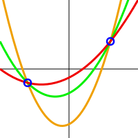

# What is secret sharing?

When we talk about 'secret sharing' we are talking about mathematical algorithms which can be used to make distributed backups of a piece of data. By distributed we mean stored in multiple locations.

These schemes are also known as threshold schemes, because they have the property that a particular threshold amount of shards are needed in order to recover the data.

From a security perspective, these schemes have advantage that if one particular location, or 'shard' is compromised, no information about the original secret is revealed.  Furthermore, there is a tolerance to a specific degree of loss - if some shards are lost, the secret can still be recovered. Choosing the threshold value represents the trade-off between security and resilience to loss.

Secret sharing schemes are nothing new.  They are usually attributed to Adi Shamir's 1979 paper 'How to share a secret'.  Although George Blakley developed a similar scheme around the same time.

## How does it work?

These schemes work using polynomial interpolation. To demonstrate the scheme we can imagine points on a curve as shown.  Actually these schemes use polynomials over a finite field which is difficult to represent in two dimensions, but the approximation can help us understand the concept.

The secret is a number.  Generally, the secret is a piece of data, which we might represent as a very large number. The secret number is the point where the curve crosses *x=0*.

The 'shards' are random points on the curve.  Suppose we have two shares, meaning we know two points the curve passes, as shown. With the type of curve shown, there are an infinite number of curves which pass through these two points. So even though we have two shares, the secret could be anything.  We dont even have a way to guess the secret and see if our guess was correct, so 'brute force' attacks are not possible.

But as soon as we know a third point this curve passes, we can use interpolation to determine every other point on the curve, including the one for *x=0*, so the secret is revealed.  So the threshold is determined by the degree of the polynomial used, and in the case of the type of curve shown, the threshold would be three.
